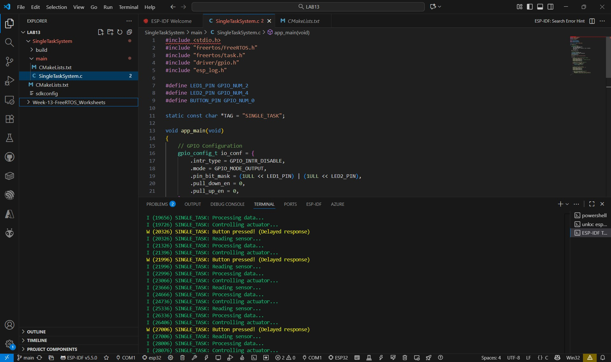
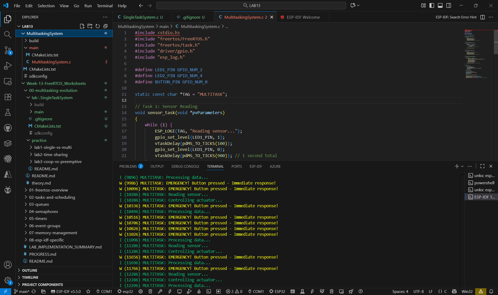

1. **ทดสอบ Single Task**:

2. **ทดสอบ Multitasking**:

## คำถามสำหรับวิเคราะห์

1. ความแตกต่างในการตอบสนองปุ่มระหว่างทั้งสองระบบคืออะไร?

ตอบ Single Task : การตอบสนองของปุ่ม ล่าช้า เพราะระบบทำงานตามลำดับในลูปเดียว ต้องรอให้งานอื่น (อ่านเซนเซอร์, ประมวลผล, ควบคุม LED) จบก่อน จึงจะตรวจปุ่มได้

Multitasking : การตอบสนองของปุ่ม รวดเร็วมาก เพราะมี Task เฉพาะ (emergency_task) ที่ตรวจปุ่มอยู่ตลอด และมี priority สูงสุด ทำให้สามารถหยุดงานอื่นชั่วคราวเพื่อตอบสนองได้ทันที

2. ใน Single Task System งานไหนที่ทำให้การตอบสนองล่าช้า?

ตอบ งานที่ทำให้การตอบสนองล่าช้ามากที่สุดคือ Processing Data Task เพราะในโค้ดมีลูปคำนวณซ้ำ (for (int i = 0; i < 1000000; i++))
ส่งผลให้ CPU ถูกใช้งานยาวต่อเนื่อง ไม่มีเวลามาเช็กปุ่มจนกว่างานนี้จะเสร็จ

3. ข้อดีของ Multitasking System ที่สังเกตได้คืออะไร?

ตอบ สามารถ ทำงานพร้อมกันได้ เช่น LED ทั้งสองดวงกระพริบในจังหวะของตัวเอง

4. มีข้อเสียของ Multitasking System ที่สังเกตได้หรือไม่?

ตอบ มีความ ซับซ้อนมากขึ้น ต้องระวังเรื่อง การใช้ทรัพยากรและการจัดการ synchronization