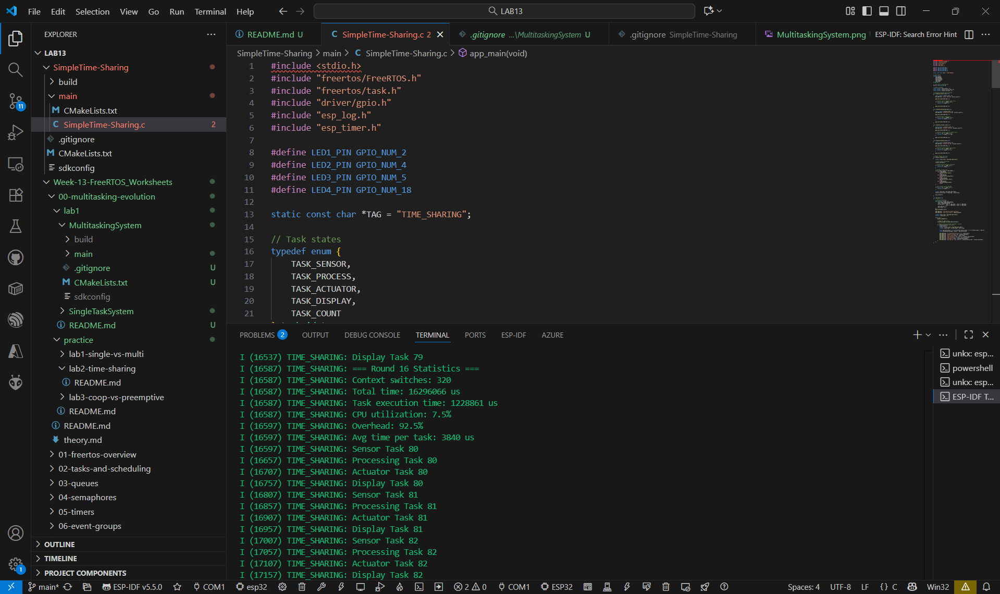
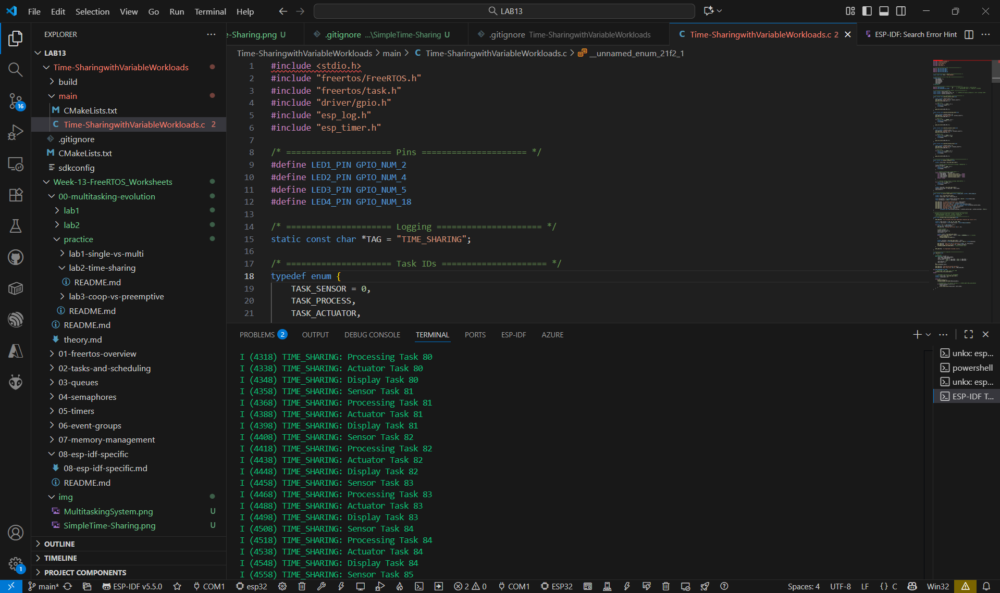
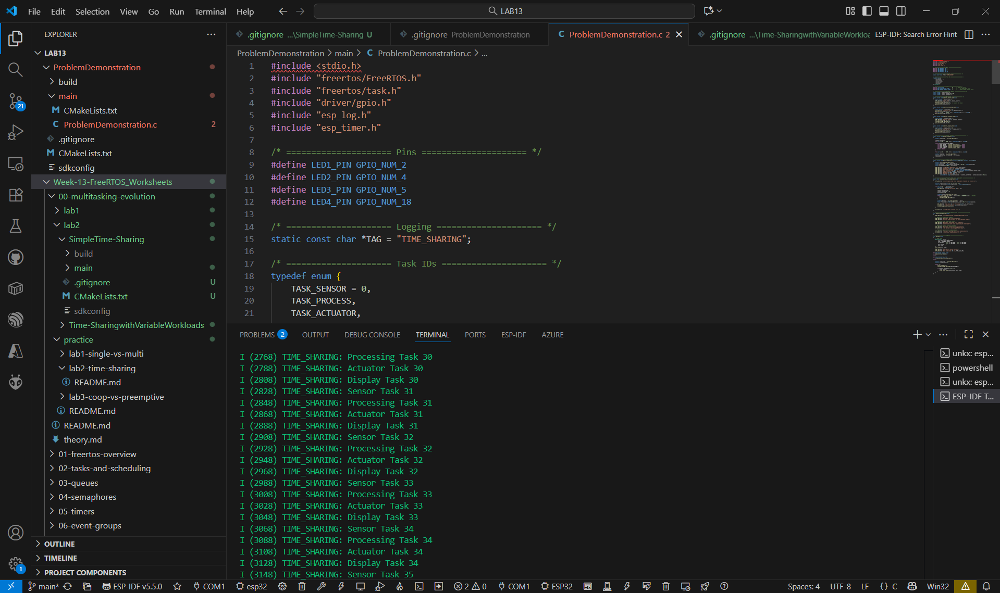

### 1. การทดสอบ SimpleTime-Sharing

### 2. การทดสอบ Time-SharingwithVariableWorkloads

### 3. การทดสอบ ProblemDemonstration

## คำถามสำหรับวิเคราะห์

1. Time slice ขนาดไหนให้ประสิทธิภาพดีที่สุด? เพราะอะไร?

ตอบ ขนาด 25–50 ms เพราะบาลานซ์ระหว่างประสิทธิภาพกับการตอบสนองได้ดี

2. ปัญหาอะไรที่เกิดขึ้นเมื่อ time slice สั้นเกินไป?

ตอบ สลับงานบ่อยทำให้เสียเวลา (overhead) สูง

3. ปัญหาอะไรที่เกิดขึ้นเมื่อ time slice ยาวเกินไป?

ตอบ งานอื่นรอนาน ทำให้ตอบสนองช้า

4. Context switching overhead คิดเป็นกี่เปอร์เซ็นต์ของเวลาทั้งหมด?

ตอบ ประมาณ 92.5 % ของเวลาทั้งหมด

5. งานไหนที่ได้รับผลกระทบมากที่สุดจากการ time-sharing?

ตอบ Processing Task เพราะใช้เวลาประมวลผลนาน ถูกสลับบ่อย