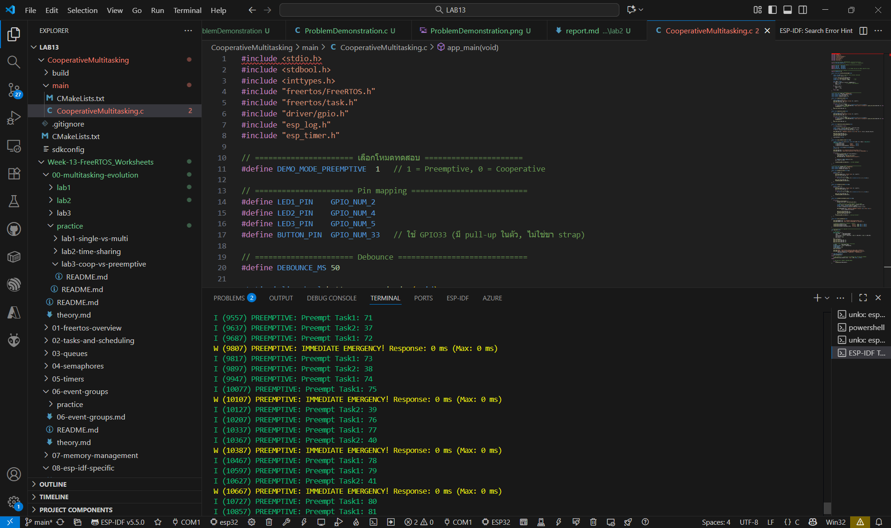
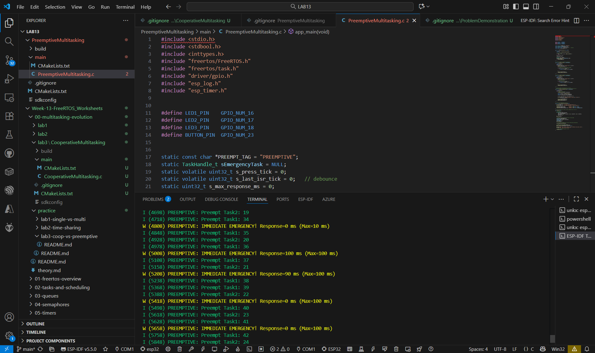

### 1. การทดสอบ Cooperative System

### 2. การทดสอบ Preemptive System

## คำถามสำหรับวิเคราะห์

1. ระบบไหนมีเวลาตอบสนองดีกว่า? เพราะอะไร?

ตอบ Cooperative Multitasking เพราะ task อื่นสามารถยอมสละเวลา (yield) ให้ emergency task ได้ทันที

2. ข้อดีของ Cooperative Multitasking คืออะไร?

ตอบ โค้ดเข้าใจง่าย ควบคุมลำดับการทำงานได้ดี ไม่มีการแย่งทรัพยากรโดยไม่ตั้งใจ

3. ข้อเสียของ Cooperative Multitasking คืออะไร?

ตอบ ถ้า task หนึ่งไม่ yield ระบบทั้งหมดจะหยุดรอ ทำให้เสี่ยงต่อการค้าง

4. ในสถานการณ์ใดที่ Cooperative จะดีกว่า Preemptive?

ตอบ งานที่มีการประมวลผลต่อเนื่อง ควบคุมลำดับได้เอง เช่น งานฝึกอบรมหรือจำลองการทำงาน

5. เหตุใด Preemptive จึงเหมาะสำหรับ Real-time systems?

ตอบ เพราะระบบสามารถสลับไปยังงานสำคัญได้ทันที โดยไม่ต้องรอให้ task อื่น yield เอง
