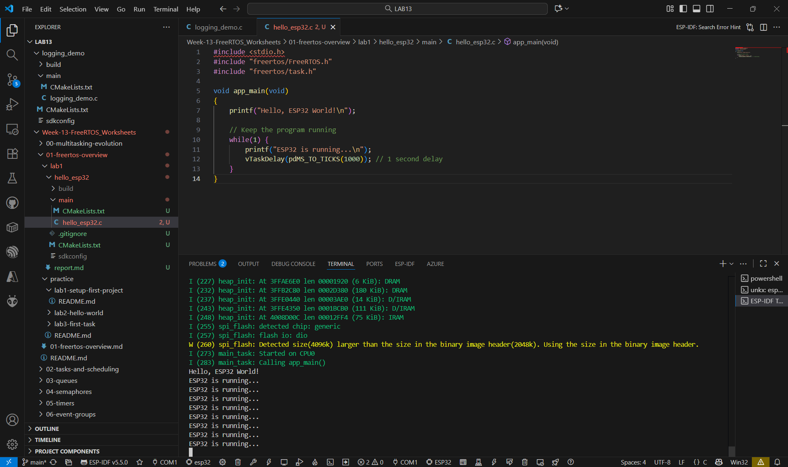

## hello_esp32

## คำถามทบทวหน

1. ไฟล์ใดบ้างที่จำเป็นสำหรับโปรเจกต์ ESP-IDF ขั้นต่ำ?

ตอบ โปรเจกต์ขั้นต่ำต้องมี
CMakeLists.txt, โฟลเดอร์ main/ ที่มี CMakeLists.txt และไฟล์ .c ที่มี app_main()

2. ความแตกต่างระหว่าง `hello_esp32.bin` และ `hello_esp32.elf` คืออะไร?

ตอบ .elf ใช้ debug และ .bin ใช้ flash ลงบอร์ด

3. คำสั่ง `idf.py set-target` ทำอะไร?

ตอบ กำหนดรุ่นของชิป ESP ที่จะใช้ build โค้ดให้ถูกต้อง

4. โฟลเดอร์ `build/` มีไฟล์อะไรบ้าง?

ตอบ hello_esp32.bin,bootloader/bootloader.bin,partition_table/partition-table.bin,hello_esp32.elf,
compile_commands.json,CMakeCache.txt,idf_py_stdout_output_xxx.log

5. การใช้ `vTaskDelay()` แทน `delay()` มีความสำคัญอย่างไร?

ตอบ vTaskDelay() ช่วยให้ระบบ multitasking มีประสิทธิภาพและเสถียร ไม่ทำให้ระบบค้างเหมือน delay()