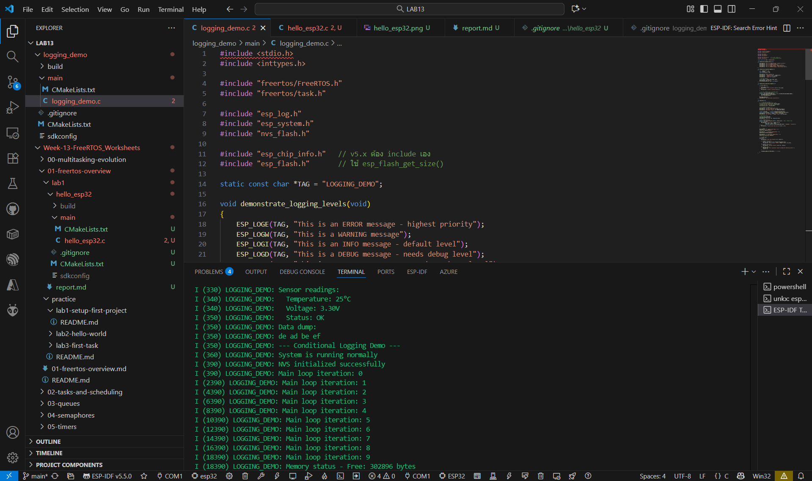
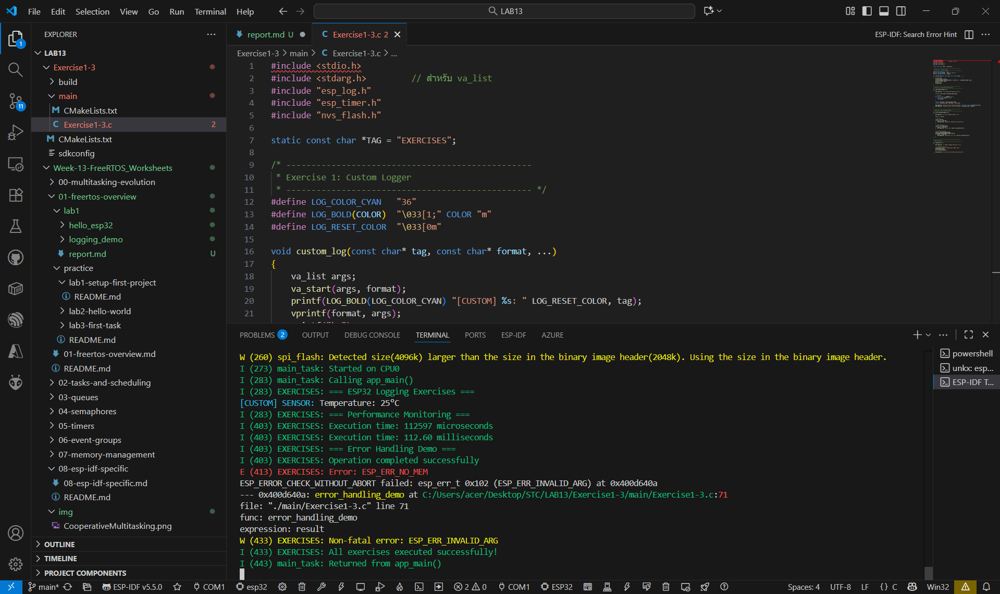

## logging_demo

## Exercise1-3

## คำถามทบทวน

1. ความแตกต่างระหว่าง `printf()` และ `ESP_LOGI()` คืออะไร?

ตอบ printf() พิมพ์ข้อความทั่วไป, ESP_LOGI() มีระดับ Log (Tag, Time, Level) และควบคุมได้

2. Log level ไหนที่จะแสดงใน default configuration?

ตอบ ค่า default คือ ESP_LOG_INFO

3. การใช้ `ESP_ERROR_CHECK()` มีประโยชน์อย่างไร?

ตอบ ESP_ERROR_CHECK() ช่วยตรวจ error อัตโนมัติ และ abort เมื่อเกิดข้อผิดพลาด

4. คำสั่งใดในการออกจาก Monitor mode?

ตอบ ออกจาก Monitor ด้วย Ctrl + ] 

5. การตั้งค่า Log level สำหรับ tag เฉพาะทำอย่างไร?

ตอบ ตั้ง Log เฉพาะ tag ด้วย esp_log_level_set("TAG", LEVEL);