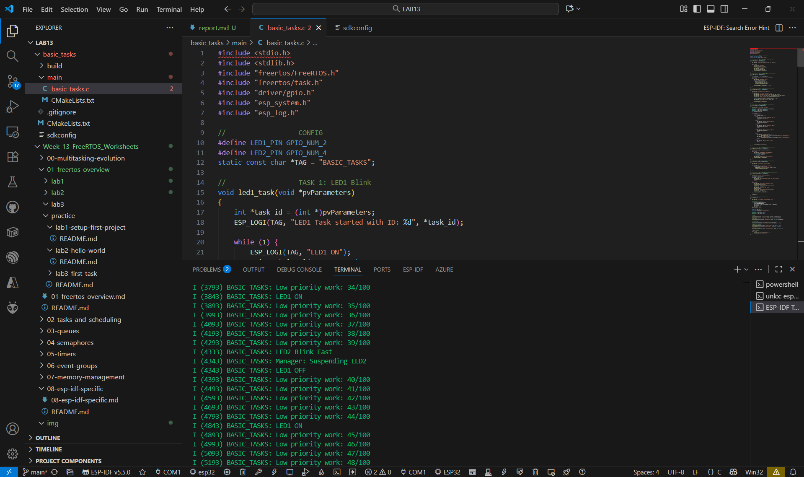
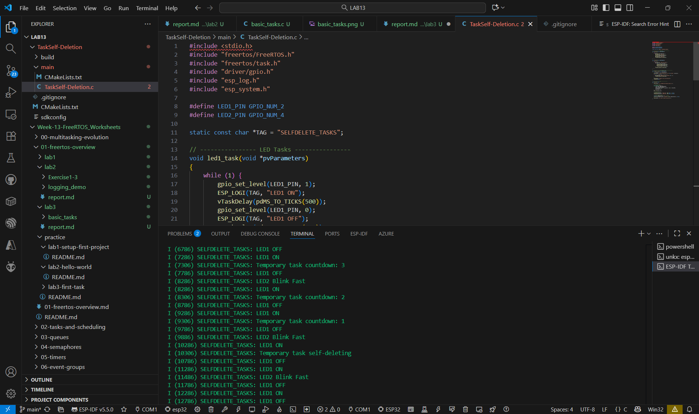
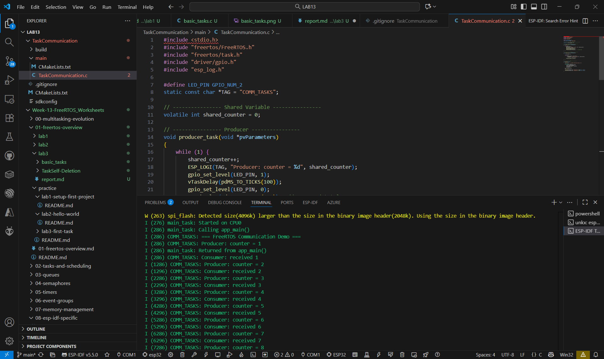

## basic_tasks

## TaskSelf-Deletion

## TaskCommunication

## คำถามทบทวน

1. เหตุใด Task function ต้องมี infinite loop?

ตอบ เพื่อให้ Task ทำงานต่อเนื่อง ไม่สิ้นสุดทันทีที่สร้าง

2. ความหมายของ stack size ใน xTaskCreate() คืออะไร?

ตอบ ขนาดหน่วยความจำ (RAM) ที่ Task ใช้เก็บตัวแปรในฟังก์ชันของมันเอง

3. ความแตกต่างระหว่าง vTaskDelay() และ vTaskDelayUntil()?

ตอบ หน่วงเวลาตามจำนวน tick จาก “ตอนนี้”

4. การใช้ vTaskDelete(NULL) vs vTaskDelete(handle) ต่างกันอย่างไร?

ตอบ vTaskDelete(NULL) จะลบ “ตัวเอง” แต่ vTaskDelete(handle) จะลบ “Task อื่น” ที่มี handle นั้น

5. Priority 0 กับ Priority 24 อันไหนสูงกว่า?

ตอบ Priority 24 สูงกว่า Priority 0