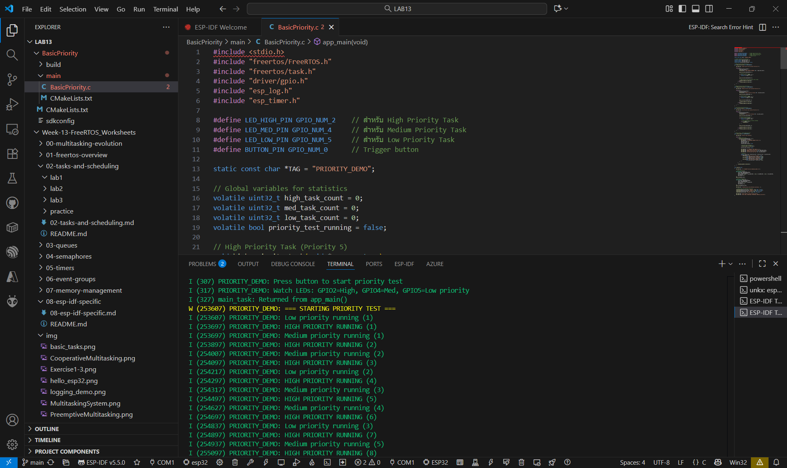
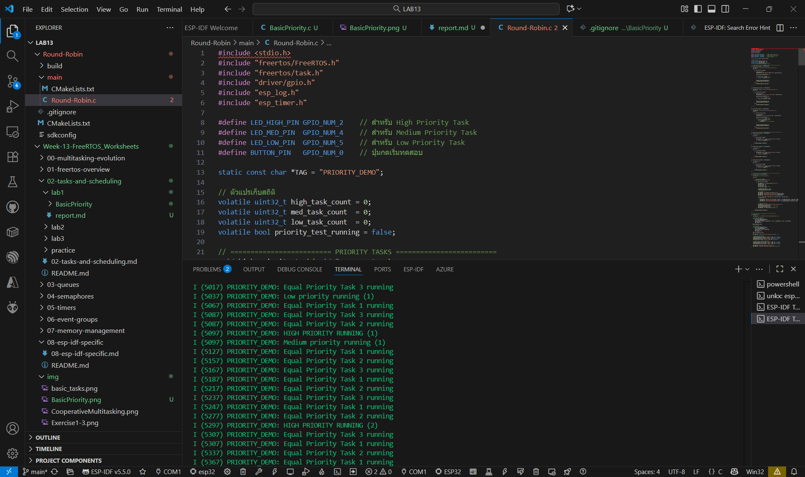
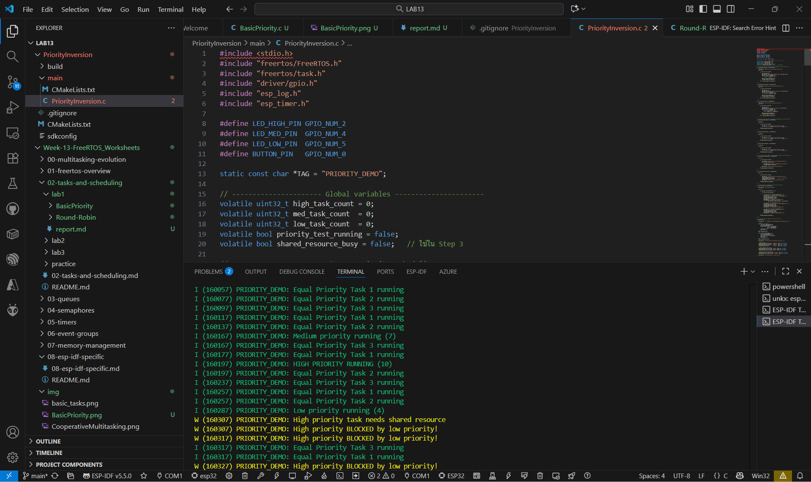
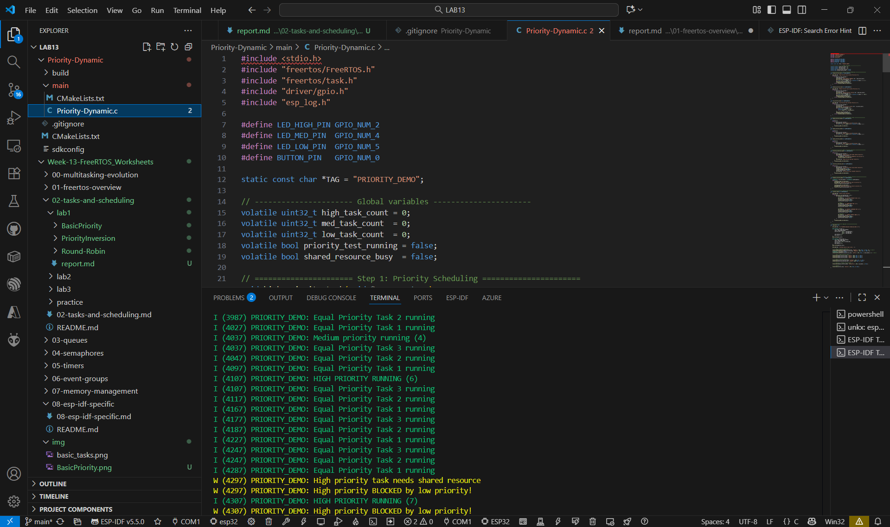

## BasicPriority

## Round-Robin

## PriorityInversion

## Priority-Dynamic

## คำถามทบทวน
1. Priority ไหนทำงานมากที่สุด? เพราะอะไร?

ตอบ High Priority ทำงานมากสุด เพราะระบบเป็น Preemptive Scheduling ให้ priority สูงสุดแย่ง CPU ได้ก่อน

2. เกิด Priority Inversion หรือไม่? จะแก้ไขได้อย่างไร?

ตอบ เกิด เพราะ Low ครอบ resource จน High ต้องรอ

3. Tasks ที่มี priority เดียวกันทำงานอย่างไร?

ตอบ ทำงานแบบ Round-Robin คือผลัดกันใช้ CPU อย่างเท่าเทียม

4. การเปลี่ยน Priority แบบ dynamic ส่งผลอย่างไร?

ตอบ ask ที่ถูก Boost จะทำงานถี่ขึ้นทันที พอกลับค่าเดิมก็ช้าลงตาม Priority

5. CPU utilization ของแต่ละ priority เป็นอย่างไร?

ตอบ High ใช้มากสุด > Medium > Equal > Low สัดส่วนใกล้เคียง 60% / 25% / 10% / 5% ตามลำดับ