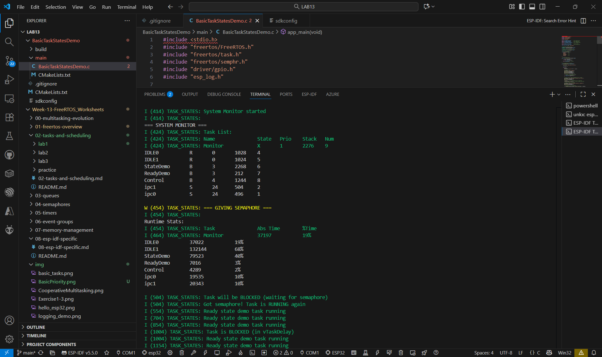
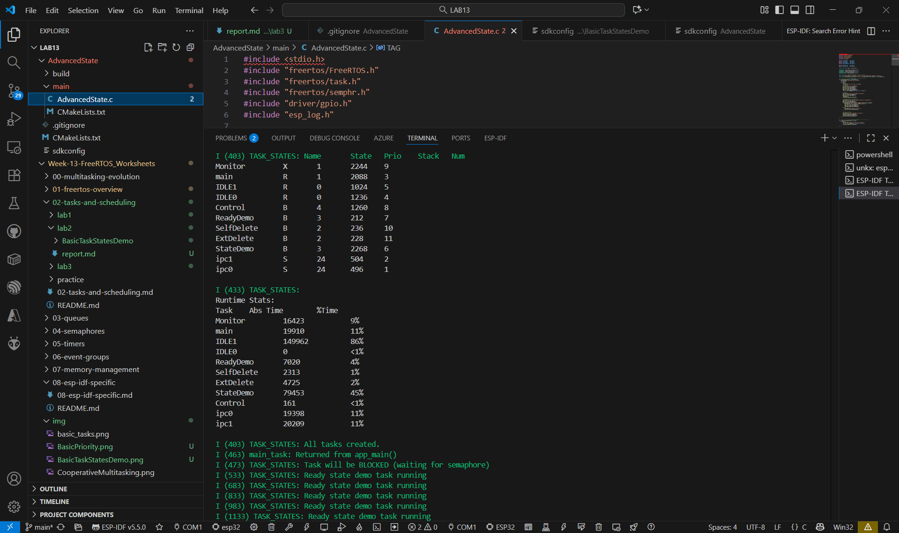
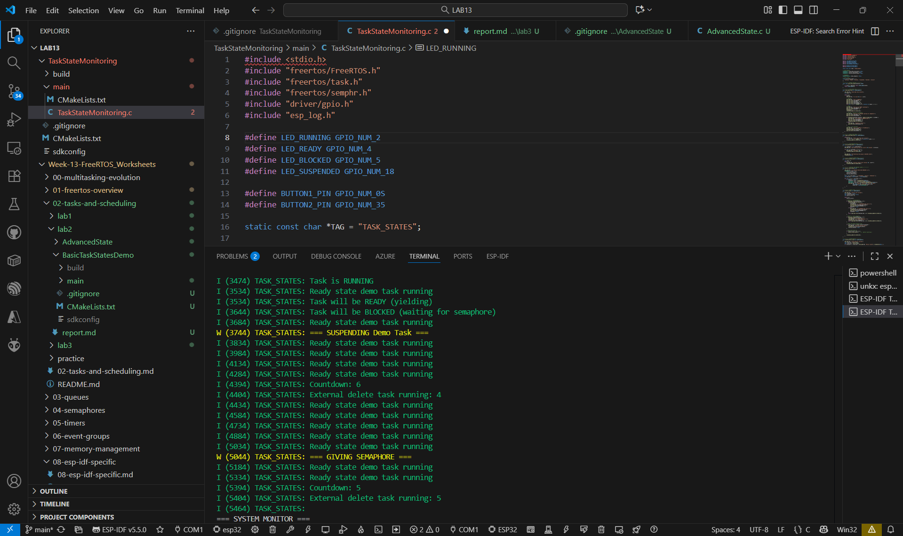
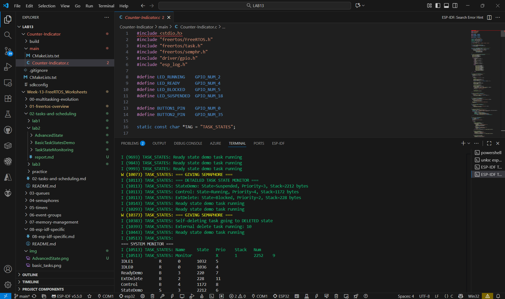

## BasicTaskStatesDemo

## AdvancedState

## TaskStateMonitoring

## Counter-Indicator

## ตอบคำถามทบทวน
1. Task อยู่ใน Running state เมื่อไหร่บ้าง?

ตอบ เมื่อ Scheduler เลือกให้ Task นั้นทำงานบน CPU ในขณะนั้น เช่น Task มี Priority สูงสุดในบรรดา Task ที่ Ready อยู่ในคิว

2. ความแตกต่างระหว่าง Ready และ Blocked state คืออะไร?

ตอบ Ready = Task พร้อมทำงาน แต่ ยังไม่ได้ CPU (รอ Scheduler เรียก)

Blocked = Task หยุดรอเหตุการณ์บางอย่าง เช่น Semaphore, Delay, Queue

3. การใช้ vTaskDelay() ทำให้ task อยู่ใน state ใด?

ตอบ ทำให้ Task เข้าสู่ Blocked state เพราะมันรอเวลาครบตามที่กำหนดก่อนจะกลับไป Ready

4. การ Suspend task ต่างจาก Block อย่างไร?

ตอบ Suspend ถูกหยุดชั่วคราวด้วยคำสั่ง (vTaskSuspend()) จะไม่กลับมาทำงานจนกว่าจะ vTaskResume()

Blocked รอเงื่อนไขบางอย่าง แล้วจะกลับมาเองเมื่อครบเงื่อนไข

5. Task ที่ถูก Delete จะกลับมาได้หรือไม่?

ตอบ ไม่ได้ เมื่อ Task ถูก vTaskDelete() หน่วยความจำและ Stack ของมันจะถูกคืนให้ระบบทันที 
หากต้องการใช้งานอีก ต้อง สร้างใหม่ด้วย xTaskCreate() เท่านั้น