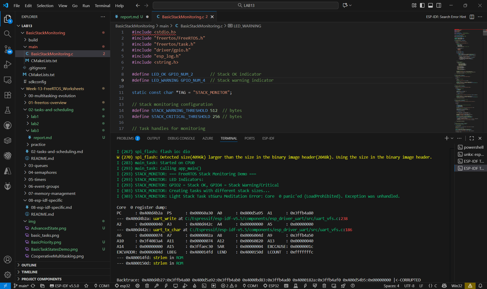
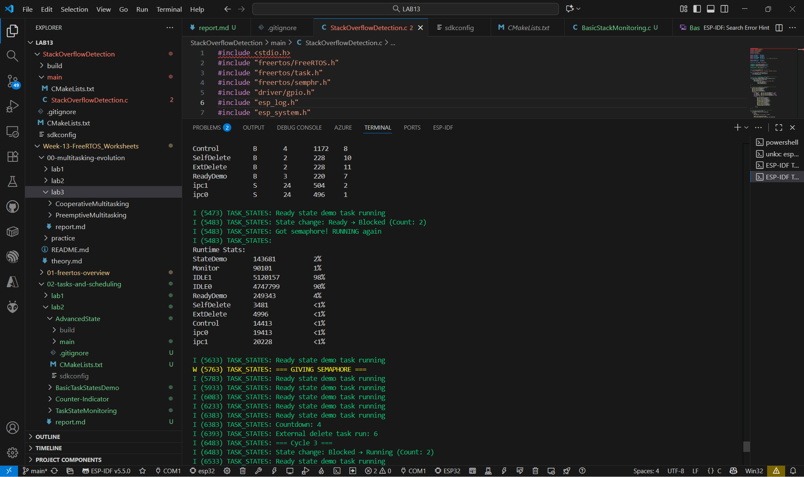
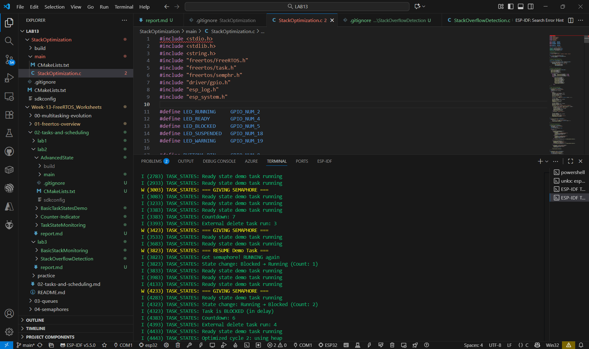
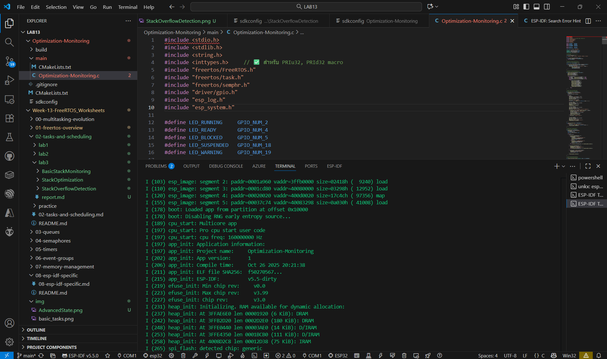

## BasicStackMonitoring

## StackOverflowDetection

## StackOptimization

## Optimization-Monitoring

## คำถามทบทวน
1. Task ไหนใช้ stack มากที่สุด? เพราะอะไร?

ตอบ heavy_stack_task เพราะประกาศตัวแปรขนาดใหญ่บน stack (char big_array[1024])

2. การใช้ heap แทน stack มีข้อดีอย่างไร?

ตอบ ช่วยลดการใช้หน่วยความจำบน stack ทำให้ป้องกัน stack overflow ได้ และจัดการหน่วยความจำได้ยืดหยุ่นกว่า

3. Stack overflow เกิดขึ้นเมื่อไหร่และทำอย่างไรป้องกัน?

ตอบ เกิดเมื่อ task ใช้หน่วยความจำบน stack เกินขนาดที่กำหนด ป้องกันโดย

- ตั้งค่า stack size ให้เหมาะสม

- ใช้ heap (malloc) สำหรับข้อมูลขนาดใหญ่

- เปิดใช้งาน CONFIG_FREERTOS_CHECK_STACKOVERFLOW=2

4. การตั้งค่า stack size ควรพิจารณาจากอะไร?

ตอบ พิจารณาจากงานใน task นั้น เช่น ขนาดตัวแปร, การเรียกฟังก์ชันซ้อนกัน (call depth), และเวลาทำงานจริง (runtime stack usage)

5. Recursion ส่งผลต่อ stack usage อย่างไร?

ตอบ ทำให้ stack ถูกใช้เพิ่มขึ้นทุกครั้งที่เรียกซ้ำ หากไม่มีเงื่อนไขหยุดอาจทำให้เกิด stack overflow ได้