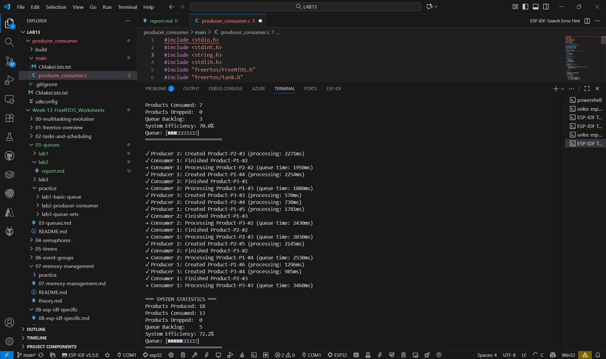
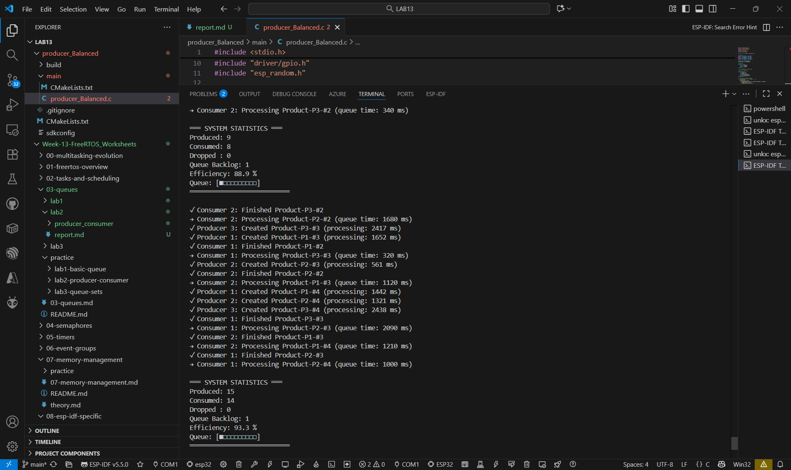
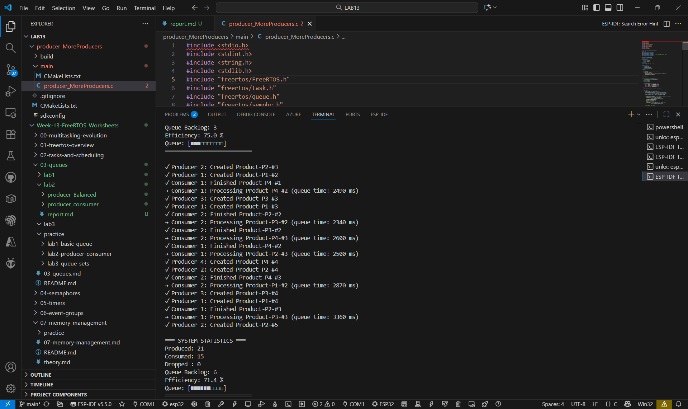
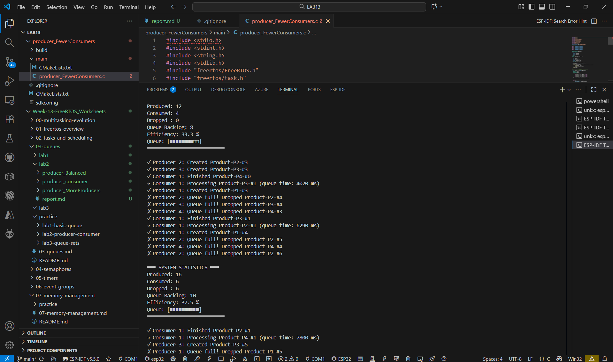
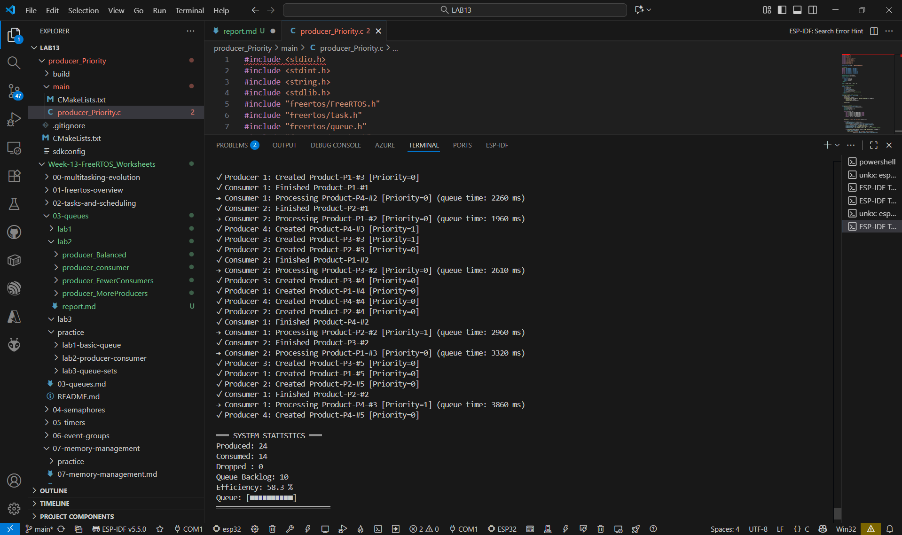
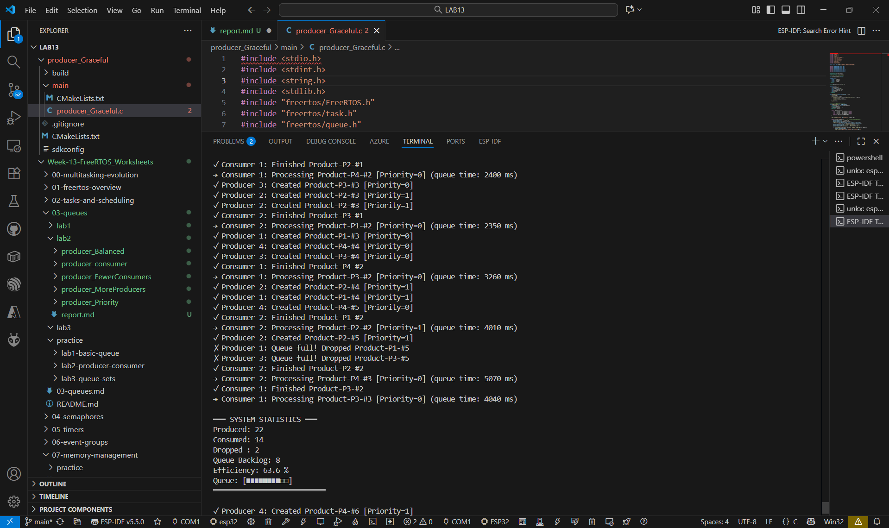
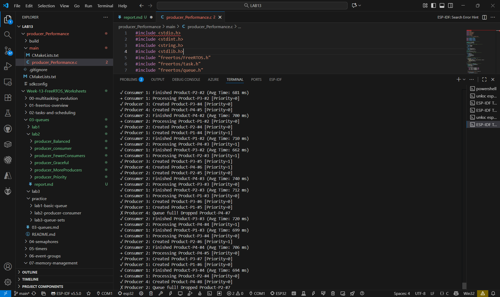

## producer_consumer

## producer_Balanced

## producer_MoreProducers

## producer_FewerConsumers

## producer_Priority

## producer_Graceful

## producer_Performance

## คำถามทบทวน
1. ในทดลองที่ 2 เกิดอะไรขึ้นกับ Queue?

ตอบ Queue เต็มบ่อย เพราะผู้ผลิตเพิ่มขึ้นมากกว่าผู้บริโภค ทำให้สินค้าถูก Drop หลายครั้ง

2. ในทดลองที่ 3 ระบบทำงานเป็นอย่างไร?

ตอบ ระบบเกิดคอขวด ผู้บริโภคทำงานไม่ทัน สินค้าค้างใน Queue จำนวนมาก ประสิทธิภาพลดลง

3. Load Balancer แจ้งเตือนเมื่อไหร่?

ตอบ เมื่อจำนวนสินค้าภายใน Queue เกินค่ากำหนด (เช่น 8 ชิ้นขึ้นไป) ระบบจะแจ้งเตือนว่าเกิดภาวะโหลดสูง