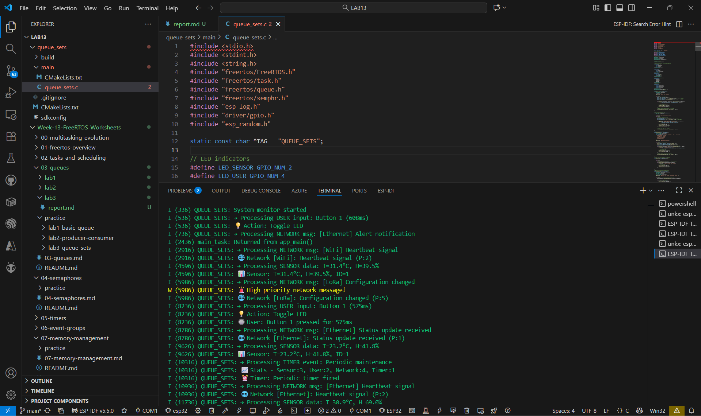

## queue_sets

## queue_Disable

## queue_Increase

## ตอบคำถามทบทวน
1. Processor Task รู้ได้อย่างไรว่าข้อมูลมาจาก Queue ไหน?

ตอบ เพราะใช้ฟังก์ชัน xQueueSelectFromSet() มันจะคืนค่าชื่อคิวที่มีข้อมูล พร้อมให้ Processor รู้ว่า message มาจาก Queue ไหน

2. เมื่อหลาย Queue มีข้อมูลพร้อมกัน เลือกประมวลผลอันไหนก่อน?

ตอบ ระบบจะเลือกคิวที่แจ้งเตือนก่อนตามลำดับใน Queue Set ว่าใครส่งเข้ามาก่อนก็ได้ประมวลผลก่อน

3. Queue Sets ช่วยประหยัด CPU อย่างไร?

ตอบ เพราะ Processor ไม่ต้องวนเช็กทุกคิวทีละอันตลอดเวลาแต่จะรอให้ Queue Set แจ้งเตือนเมื่อมีข้อมูลเข้ามาทำให้ CPU ไม่ต้องเสียเวลา Polling และเข้าสู่โหมดพักได้เมื่อไม่มีงาน