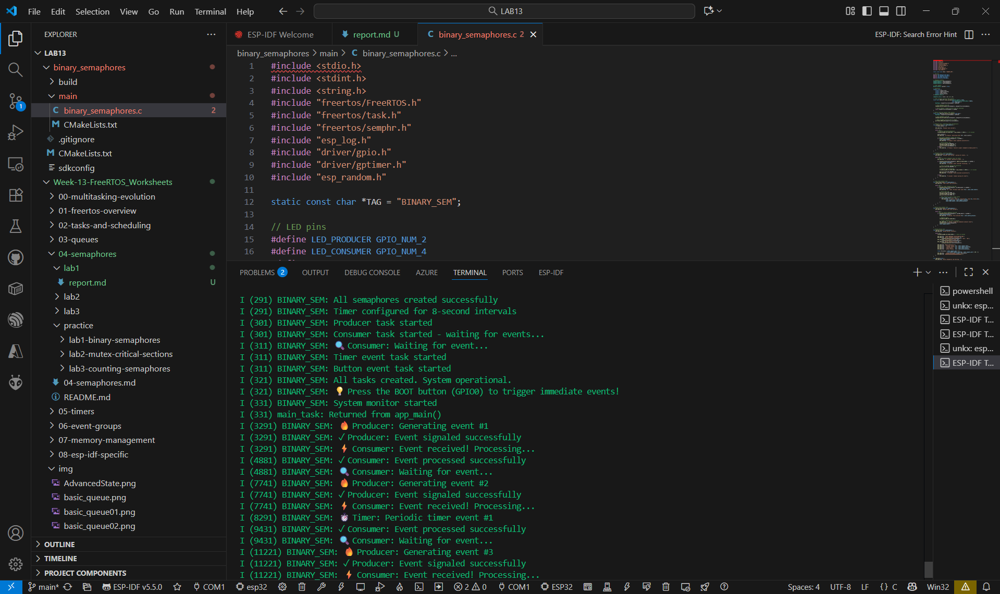
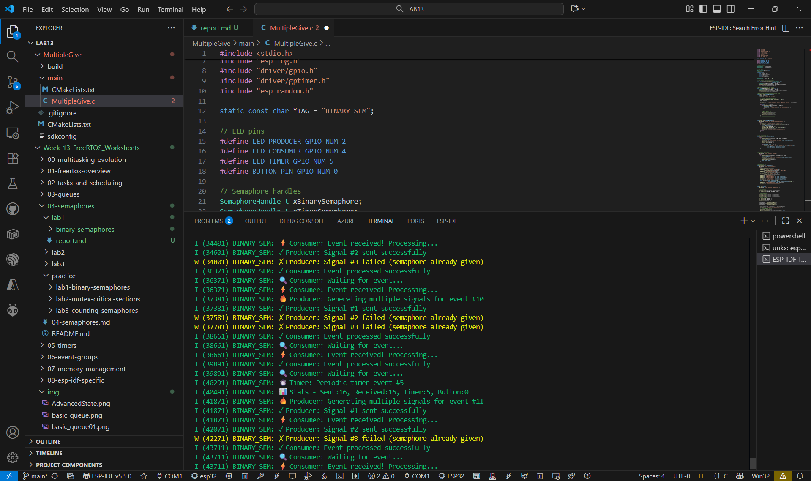
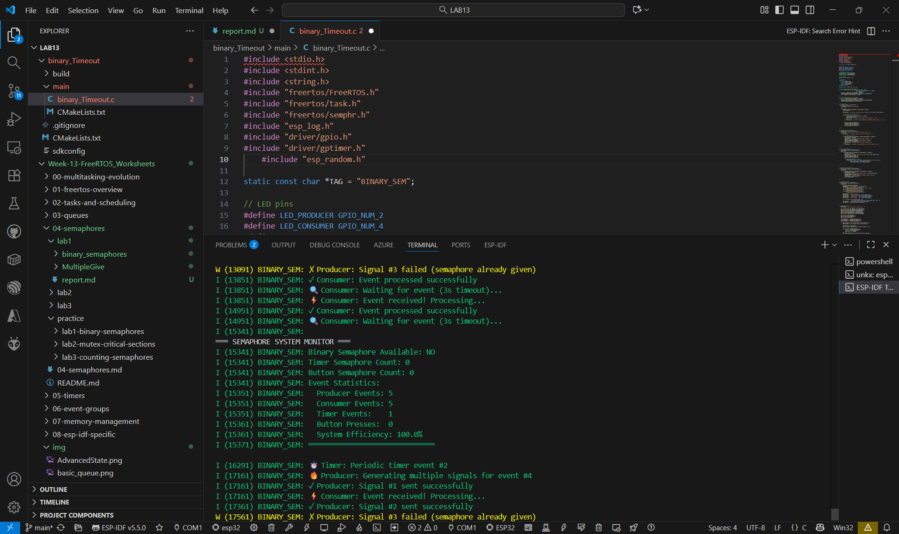

## binary_semaphores

## MultipleGive 

## binary_Timeout

## คำถามทบทวน
1. เมื่อ give semaphore หลายครั้งติดต่อกัน จะเกิดอะไรขึ้น?

ตอบ Binary Semaphore จะเก็บได้แค่ 1 ครั้งเท่านั้น สัญญาณที่เกินจะถูกทิ้ง

2. ISR สามารถใช้ xSemaphoreGive หรือต้องใช้ xSemaphoreGiveFromISR?

ตอบ xSemaphoreGiveFromISR() เพราะ ISR ห้ามเรียกฟังก์ชันปกติที่อาจบล็อกระบบ

3. Binary Semaphore แตกต่างจาก Queue อย่างไร?

ตอบ Binary Semaphore ส่งแค่สัญญาณ แต่ Queue ใช้ส่งข้อมูลจริงระหว่าง Task