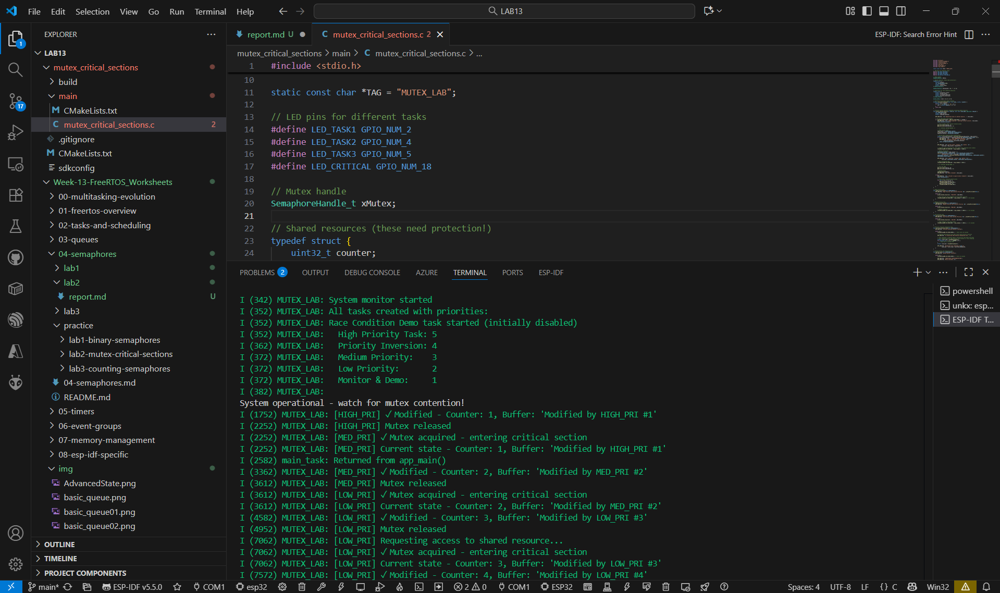
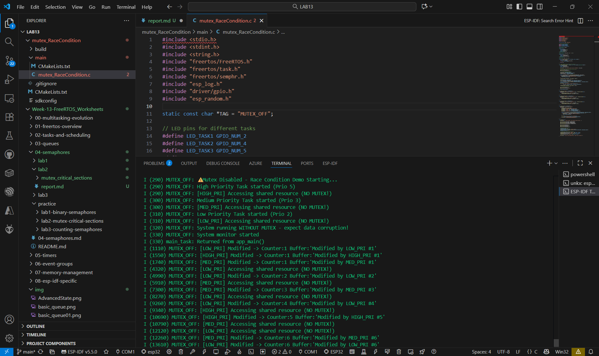
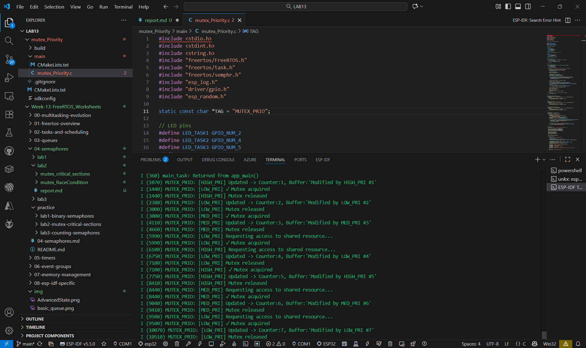

## mutex_critical_sections

## mutex_RaceCondition 

## mutex_Priority

## คำถามทบทวน
1. เมื่อไม่ใช้ Mutex จะเกิด data corruption หรือไม่?

ตอบ เกิดได้แน่นอน เพราะหลาย Task เข้าถึงและเขียนข้อมูลพร้อมกันโดยไม่มีการป้องกัน ทำให้ค่าถูกเขียนทับหรือคำนวณผิด

2. Priority Inheritance ทำงานอย่างไร?

ตอบ ถ้า Task ลำดับสูงต้องรอ Mutex ที่ Task ลำดับต่ำถืออยู่ ระบบจะยก Priority ของ Task ล่างขึ้นชั่วคราว
เพื่อให้มันทำงานจบและปล่อย Mutex เร็วขึ้น ป้องกัน Priority Inversion

3. Task priority มีผลต่อการเข้าถึง shared resource อย่างไร?

ตอบ Task ที่มี Priority สูงจะได้สิทธิ์รันก่อน ทำให้มีโอกาสเข้าถึง resource บ่อยกว่า
แต่ถ้า Priority ต่ำถือ Mutex ไว้ก่อน Task สูงต้องรอจนกว่าจะถูกปล่อย