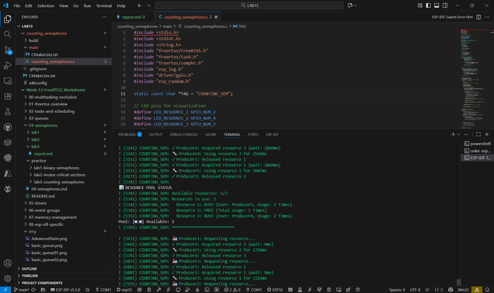
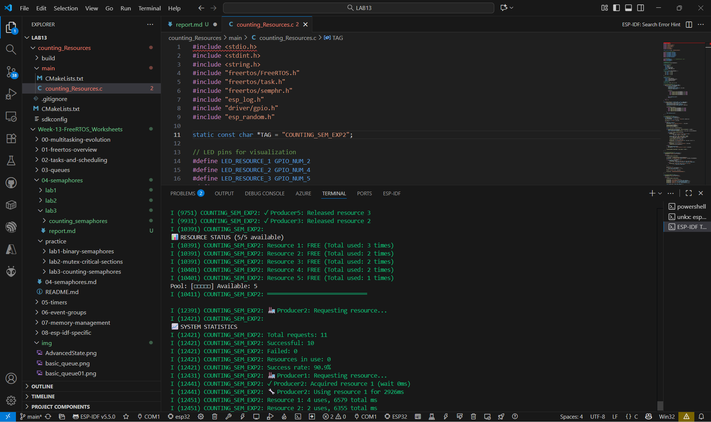
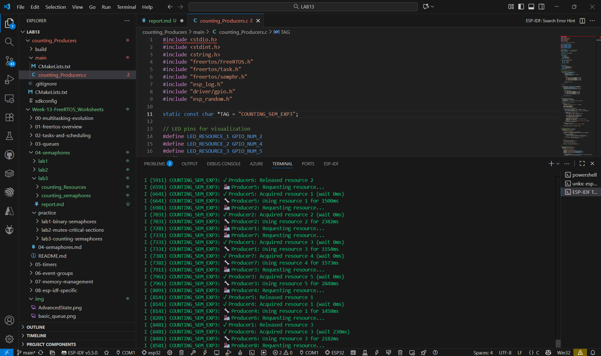

## counting_semaphores

## counting_Resources 

## counting_Producers

## คำถามทบทวน
1. เมื่อ Producers มากกว่า Resources จะเกิดอะไรขึ้น?

ตอบ บาง Producer ต้องรอคิวหรือ Timeout เพราะทรัพยากรไม่พอให้ใช้พร้อมกันทั้งหมด

2. Load Generator มีผลต่อ Success Rate อย่างไร?

ตอบ เมื่อ Load Generator สร้างคำขอจำนวนมากพร้อมกัน ระบบจะมีการแย่งทรัพยากรมากขึ้น Success Rate ลดลง
เพราะบางคำขอหมดเวลาก่อนถึงคิว

3. Counting Semaphore จัดการ Resource Pool อย่างไร?

ตอบ ใช้ตัวนับแทนจำนวนทรัพยากรที่เหลืออยู่ ทุกครั้งที่ Task ขอใช้จะลด count ลง
เมื่อคืนทรัพยากรจะเพิ่ม count กลับ ทำให้สามารถควบคุมการเข้าถึงทรัพยากรจำนวนจำกัดได้อย่างปลอดภัยและเป็นระเบียบ